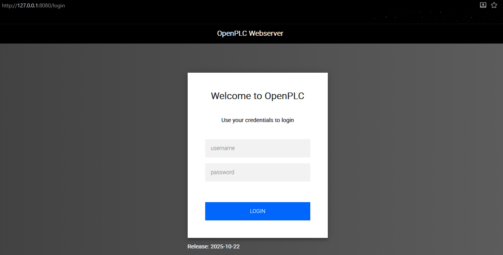
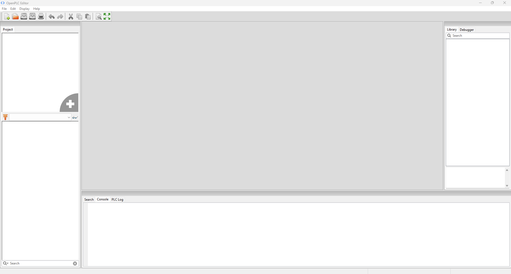
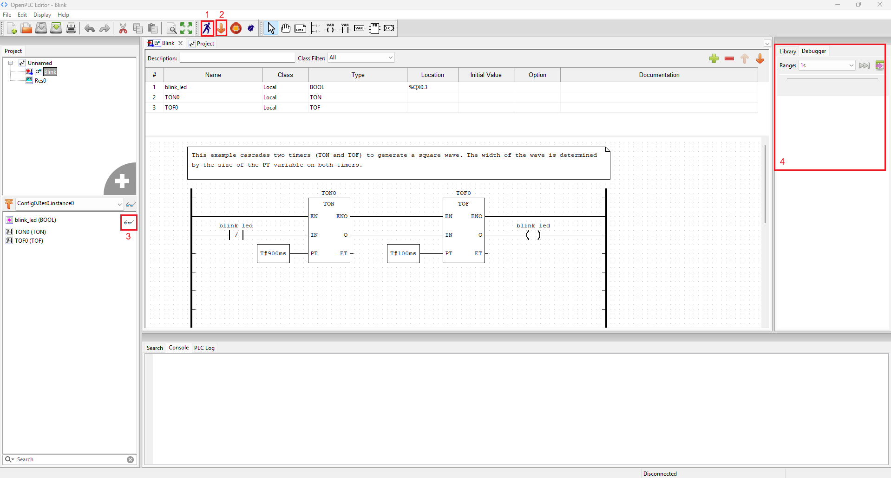
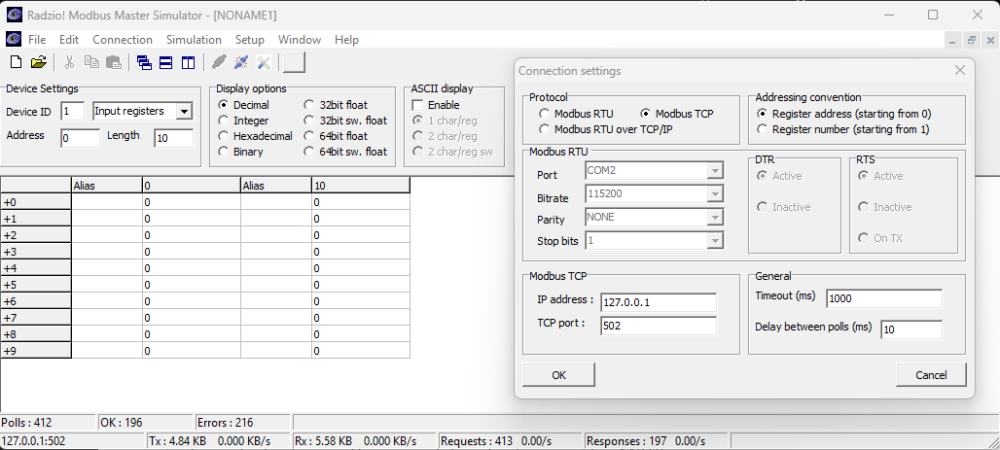
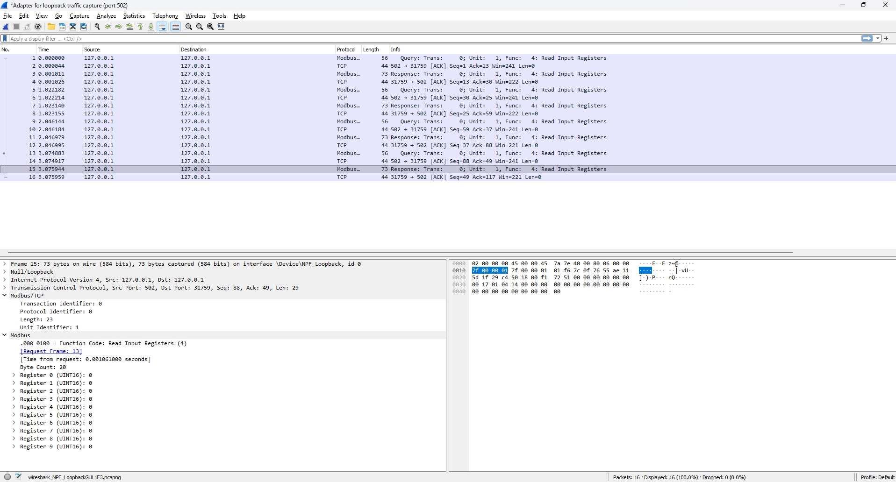
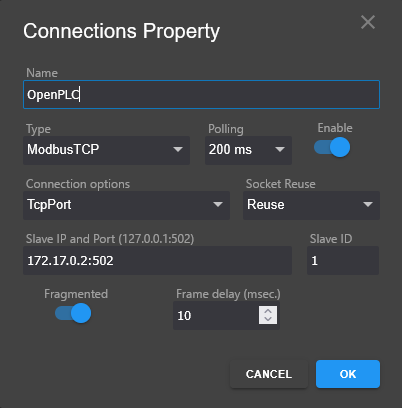
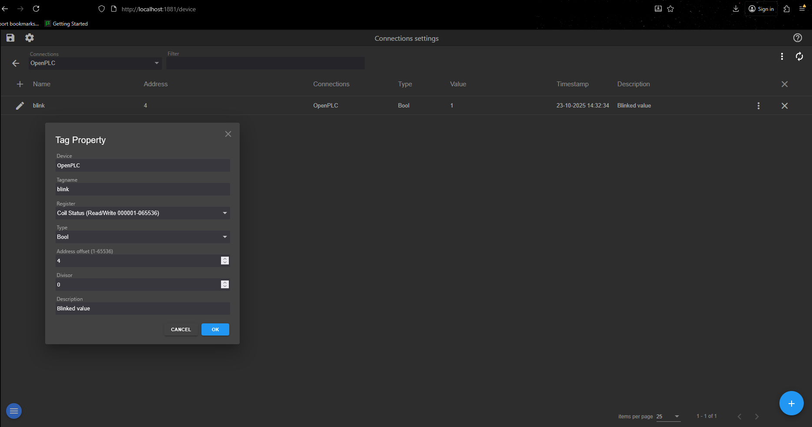

## Overview
This repository provides instructions for creating a 'digital twin' ICS lab which behaves identically to production ICS/OT gear at the network level. This lab will mimic a turbine generator and consist of a PLC, HMI, and dummy Python load. It contains no modern security measures and is vulnerable to well-understood attacks such as replays and MitM, making it ideal for cybersecurity education and training.

## Motivation and Roadmap
This guide may be understood as instructions for building a series of [Black Triangles](https://rampantgames.com/blog/?p=7745). The term was coined by Jay Barnson while working at the video game company SingleTrac, which made such classics as Twisted Metal (emphasis added, as well as some commas):
> It was sometime in my first week, possibly my first or second day. In the main engineering room, there was a whoop and cry of success.
>
> Our company financial controller and acting HR lady, Jen, came in to see what incredible things the engineers and artists had come up with. Everyone was staring at a television set hooked up to a development box for the Sony Playstation. There, on the screen, against a single-color background, was a black triangle.
>
> “It’s a black triangle,” she said in an amused but sarcastic voice. One of the engine programmers tried to explain, but she shook her head and went back to her office. I could almost hear her thoughts… “We’ve got ten months to deliver two games to Sony, and they are cheering over a black triangle? THAT took them nearly a month to develop?”
>
> What she later came to realize (and explain to others) was that the black triangle was a pioneer. It wasn’t just that we’d managed to get a triangle onto the screen. That could be done in about a day. It was the journey the triangle had taken to get up on the screen. It had passed through our new modeling tools, through two different intermediate converter programs, had been loaded up as a complete database, and been rendered through a fairly complex scene hierarchy, fully textured and lit (though there were no lights, so the triangle came out looking black). <em><strong>The black triangle demonstrated that the foundation was finally complete, the core of a fairly complex system was completed, and we were now ready to put it to work doing cool stuff</em></strong>. By the end of the day, we had complete models on the screen, manipulating them with the controllers. Within a week, we had an environment to move the model through.
>
> Afterwards, we came to refer to certain types of accomplishments as “black triangles.” These are important accomplishments that take a lot of effort to achieve, but upon completion you don’t have much to show for it only that more work can now proceed. It takes someone who really knows the guts of what you are doing to appreciate a black triangle.

The construction of the lab thus proceeds in stages. First, an OpenPLC Docker image must be created as a virtual PLC. This can be programmed with OpenPLC editor to blink an LED (the classic cyber-physical 'hello world'), and this behavior can then be validated in the OpenPLC web console. Tools such as the Radzio Modbus Master Simulator and Wireshark can then be used to verify that the new PLC responds to Modbus queries. This is Black Triangle 1.

Next, an HMI must be built in Docker. This lab will use the FOSS HMI Fuxa. Once the HMI is constructed, it may be configured to display data from the PLC, send queries, and display responses. Wireshark can again be used to verify that this network traffic is proceeding as expected - this network communication is one of the most vulnerable to malicious interference, and so it must be thoroughly understood. The HMI should now also provide an intuitive interface to monitor and control the PLC - this is Black Triangle 2. Note that an attacker can manipulate Black Triangle 1 (network traffic) while leaving Black Triangle 2 (HMI display) unaffected - this is a common technique used by attackers to hide compromise from system operators, such as the authors of [Stuxnet](https://www.wired.com/2014/11/countdown-to-zero-day-stuxnet/).

## Detailed Instructions
### Install prerequisites:
- Docker
- Git
- Wireshark
- Radzio
### Before we begin
Modbus is often referred to as a 'master-slave' protocol. This terminology is both uncomfortable and unnecessary, as Modbus can just as easily be described as a traditional client-server protocol, with 'masters' as clients and 'slaves' as servers. We will use this terminology throughout this lab.

### OpenPLC
In this section, we will install the OpenPLC Docker container, which we will program in the next section.

1. First, load OpenPLC in Docker (instructions from https://github.com/thiagoralves/OpenPLC_v3)

       git clone https://github.com/thiagoralves/OpenPLC_v3.git
       cd OpenPLC_v3
       docker build -t openplc:v3 .
       docker run -it --rm --privileged -p 8080:8080 openplc:v3

    If you receive the following error:

       docker: Error response from daemon: failed to create task for container: failed to create shim task: OCI runtime create failed: runc create failed: unable to start container process: exec: "./start_openplc.sh": stat ./start_openplc.sh: no such file or directory: unknown.

    then back out, delete the folder, and run the steps again with this git clone command:

       git -c core.eol=lf -c core.autocrlf=false clone https://github.com/thiagoralves/OpenPLC_v3.git

    once done, should say that it's running on TCP 8443. open a web browser and go to http://127.0.0.1:8080. you should see the following:

    

    log in with default creds 'openplc:openplc'

    (TODO) overview of this portal

### OpenPLC Editor
In this section, we will install the OpenPLC Editor, and use it to program the virtual PLC we created in the last section. 

1. Download and install OpenPLC Editor by following the instructions on [this page](https://autonomylogic.com/download/).
2. Start OpenPLC Editor. You should see a screen similar to the following.

3. Load the sample project 'Blink'.

    a. Click 'File' in top left, then 'Tutorials and Examples', then '5. Blink'. Blinking an LED is the 'Hello, World' of cyber-physical systems/embedded programming.

    b. Double click 'Blink' in Project pane on top left. Your screen should now look similar to the following.
    
    
    c. This program is written in Ladder Logic and uses two [timer blocks](https://www.fernhillsoftware.com/help/iec-61131/common-elements/standard-function-blocks/on-delay-timer.html) to turn the variable 'blink_led' from True to False and back again.  
      1. The '[/]' next to 'blink_led' which feeds into the TON0 IN is an IEC61131-3 Ladder Logic symbol meaning 'Normally Closed Contact'. The '( )' next to 'blink_led' which is fed by TOF0 Q is a symbol meaning 'Open Coil'. Contacts are inputs, and a Normally Closed Contact will output True when its associated variable has value False, and vice versa. Coils are outputs which set the value of their associated variables.
      2. For a TON (Turn On) block, the input EN (Enable) must be set True (also called High or 1) for the timer to function. The output ENO (Enable Output) tracks the value of EN.
      3. A rising edge on the input IN (Input) starts the timer.
      4. When IN is triggered (see step 3c2 above), the output ET (Elapsed Time) increases until it equals input PT (Programmed/Preset Time). At that point, output Q (standard name for circuit block output) is set True, and remains in this state until EN goes to False.
      5. When a TON block has input EN set to False, output Q is False, and output ET is 0.
      6. TOF (Turn Off) blocks behave the same, except that when input EN is True, Q is True and ET is 0. When EN goes False, the timer behaves as described in steps 3c2-3c3 above, except that when ET=PT, Q goes False.
      7. In this example, both TON0 and TOF0 have their PT inputs set by constant variables (900ms for TON0 and 100ms for TOF0).
    
    d. Run simulation
      1. In the second pane from top, click the running person icon, 'Start PLC Simulation' (marked 1 in the 3b diagram).
      2. In bottom left pane, click sunglasses next to 'blink_led (BOOL)' (marked 3 in the 3b diagram).
      3. In Debugger (right pane, marked 4 in 3b diagram), watch the value of blink_led switch from True for 100ms, to False for 900ms, to True for 100ms, etc. Double click on 'blink_led' in the Debugger pane to view a graph of its value over time.
      4. In the second pane from top, where the running person icon was, click the stop sign to stop simulation.
      5. Edit the PT inputs, and run the simulation again. How does changing the duration of the timers affect the value of 'blink_led'/shape of the output waveform?
    
    e. Program OpenPLC
      1. Next to the running person icon from the previous step, click the down arrow, 'Generate Program for OpenPLC Runtime' (marked 2 in the 3b diagram).
      2. Navigate to your project folder and save the compiled output as 'blink.st' or similar.
      3. In OpenPLC, click Programs in the left pane.
      4. Under Upload Program, click Browse, and select 'blink.st'. Then click Upload Program.
      5. In the next page, give your program a title. The other fields are optional.
      6. Once done, click 'Start PLC' in the bottom left.
      7. Navigate to 'Monitoring' and watch the LED blink on and off.
      8. When done, you may click the button in bottom left to 'Stop PLC'.
    
    f. View traffic
      1. If you turned off the PLC in the last step, turn it on again.
      2. Load up Wireshark, capture on 'Adapter for loopback traffic capture' with filter 'port 502'
      3. Open Radzio, go to Connection settings, ensure Modbus TCP is selected, ensure the IP address is '127.0.0.1' and port is 502, then click OK. See screenshot below.
        
      4. In Wireshark, click the blue fin in top left, 3rd pane, to start packet capture. From the top pane in Radzio, select Connection > Connect. You should see traffic in Wireshark that resembles the following (capture was stopped following 4 query-response cycles).
        

### HMI
At this point, you should have a virtual PLC programmed to blink its %QX0.3 coil on and off. You should be able to monitor the value of this variable with a Modbus client such as Radzio, and observe the associated Modbus traffic between your workstation and the OpenPLC container using Wireshark. Now, we will create a virtual HMI (Human Machine Interface) to more easily interact with our PLC. 

OpenPLC can connect to any HMI that can communicate with it over the Modbus protocol. Two of the most popular options for virtual HMIs are ScadaBR and Fuxa. Pros and cons of each are discussed below; for this guide, we will use Fuxa, mostly because the ScadaBR docs are in Portuguese.

#### ScadaBR
PROS:
  - free and open source
  - integrates very well with OpenPLC
  - [official video tutorial](https://www.youtube.com/watch?v=KrcL6lhAHKw)
  
CONS:
  - no commits to project in two years ([most recent commit 2023-02-03](https://github.com/ScadaBR/ScadaBR))
  - documentation is written in Portuguese

#### Fuxa
PROS:
  - free and open source
  - modern interface
  - extensive [docs](https://github.com/frangoteam/FUXA/wiki)

CONS:
  - fewer community resources

Instructions:
1. Download and install Fuxa container
            
       // from https://github.com/frangoteam/FUXA
       // ---------------------------------------
       // basic
       docker pull frangoteam/fuxa:latest
       docker run -d -p 1881:1881 frangoteam/fuxa:latest

       // persistent storage of application data (project), daq (tags history), logs and images (resource)
       docker run -d -p 1881:1881 -v fuxa_appdata:/usr/src/app/FUXA/server/_appdata -v fuxa_db:/usr/src/app/FU

       // with Docker compose
       // persistent storage will be at ./appdata ./db ./logs and ./images
       wget https://raw.githubusercontent.com/frangoteam/FUXA/master/compose.yml
       docker compose up -d     

3. Navigate to http://127.0.0.1:1881 in browser. Screen should be mostly blank, with blue circle in bottom left and orange circle in bottom right. Click the blue circle, then click Editor. It should look like the following.

    

4. Click the gear in the top left, and click Plugins. Drat, Modbus-TCP is not installed. We can add that by:

    a. Go to terminal, and type "docker ps" to view running images.

    b. Find the fuxa container in the output. Note its UID (called $FULL_ID in these instructions) at the start of the line, or rather, the first 4 characters of this UID (eg: d931; called $SHORT_ID in these instructions). 

    c. Execute the following to enter a bash shell inside the container: 
    > docker exec -it $SHORT_ID bash

    d. Execute the following:
    > whoami; hostname

    Your output should resemble the following.

       root
       $FULL_UID

    e. Execute the following: 
    > npm install modbus-tcp
       
    Your output should resemble the following.

       added 1 packages in 2s
    f. Execute the following. Note that the first command exits the container bash shell, so that the second command is executed in the context of the host machine.
    > exit

    > docker restart $SHORT_ID

    g. Execute the following.
    > docker inspect -f '{{range .NetworkSettings.Networks}}{{.IPAddress}}{{end}}' $SHORT_ID

    Your output should resemble the following. This IP address is called $PLC_IP in these instructions.

       172.17.0.2
       
    g. In Fuxa, click the gear, click Connections. Click the Plus in the bottom right. Select type 'ModbusTCP', and fill out the connection as follows (note that $PLC_IP, not localhost, must be used)
    
    

    h. Click the 'link' icon on the connection to open the Connections Settings screen. Click the Plus in the bottom right. Fill out the connection form to match the Tag Property popup in the screenshot below (note that the address offset is 4, not 3; Fuxa counts the first coil as 1, not 0). Click OK. After a few seconds, the Connection settings page should resemble the screenshot below.

    

    i. Go to other screen and make blinking red light (TODO)
    
    j. You can use tcpdump to get an internal packet capture and show it in Wireshark (TODO)

### Writing Ladder Logic
We're almost done! We now have an OpenPLC container talking to a Fuxa container over the industry-standard Modbus protocol. However, at this point, the HMI can only query the output of the PLC. Let's write a new program for the PLC that will turn the light on and off based on input from the HMI. 

### Replay Attack
The lab is complete! Let's use it to test out a classic ICS/OT pentesting technique, the replay attack!

### Conclusion

## Acknowledgments
- Huge thanks to Dr. Thiago Alves for all his work on the OpenPLC project.
- Thanks to seafoxc for their Youtube tutorial on [connecting Fuxa to OpenPLC](https://www.youtube.com/watch?v=OQA5eVge0l8).