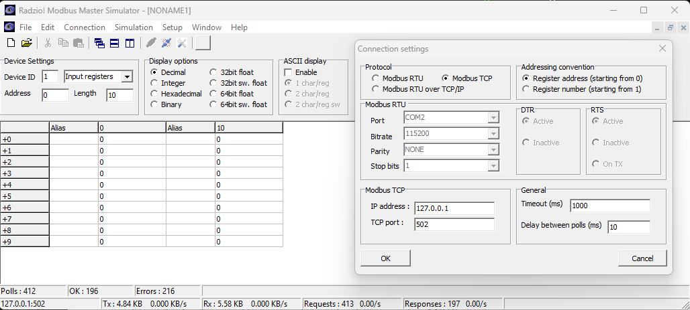
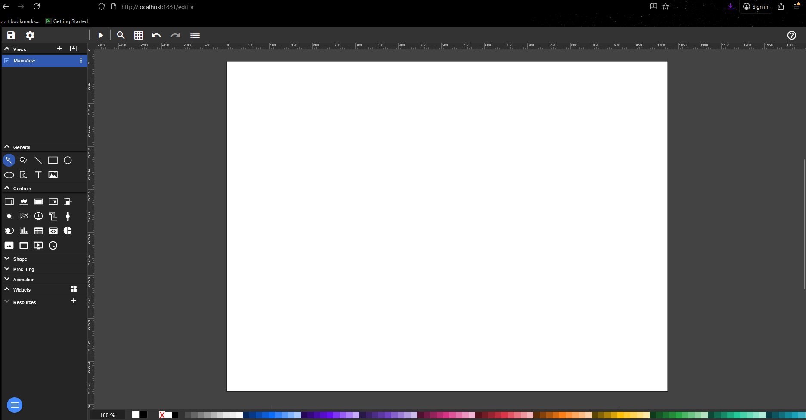

## Overview
GOAL: Participants in this lab will construct a 'digital twin' of a turbine generator, consisting of a PLC, HMI, and dummy Python load.

We're here to build a series of [Black Triangles](https://rampantgames.com/blog/?p=7745). The term was coined by Jay Barnson while working at the video game company SingleTrac, which made such classics as Twisted Metal (emphasis added, as well as some commas):
> It was sometime in my first week, possibly my first or second day. In the main engineering room, there was a whoop and cry of success.
>
> Our company financial controller and acting HR lady, Jen, came in to see what incredible things the engineers and artists had come up with. Everyone was staring at a television set hooked up to a development box for the Sony Playstation. There, on the screen, against a single-color background, was a black triangle.
>
> “It’s a black triangle,” she said in an amused but sarcastic voice. One of the engine programmers tried to explain, but she shook her head and went back to her office. I could almost hear her thoughts… “We’ve got ten months to deliver two games to Sony, and they are cheering over a black triangle? THAT took them nearly a month to develop?”
>
> What she later came to realize (and explain to others) was that the black triangle was a pioneer. It wasn’t just that we’d managed to get a triangle onto the screen. That could be done in about a day. It was the journey the triangle had taken to get up on the screen. It had passed through our new modeling tools, through two different intermediate converter programs, had been loaded up as a complete database, and been rendered through a fairly complex scene hierarchy, fully textured and lit (though there were no lights, so the triangle came out looking black). <em><strong>The black triangle demonstrated that the foundation was finally complete, the core of a fairly complex system was completed, and we were now ready to put it to work doing cool stuff</em></strong>. By the end of the day, we had complete models on the screen, manipulating them with the controllers. Within a week, we had an environment to move the model through.
>
> Afterwards, we came to refer to certain types of accomplishments as “black triangles.” These are important accomplishments that take a lot of effort to achieve, but upon completion you don’t have much to show for it only that more work can now proceed. It takes someone who really knows the guts of what you are doing to appreciate a black triangle.

## Detailed Instructions
### Install prerequisites:
- Docker
- Git
- Wireshark
- Radzio
### Install OpenPLC
1. First, load OpenPLC in Docker (instructions from https://github.com/thiagoralves/OpenPLC_v3)

        git clone https://github.com/thiagoralves/OpenPLC_v3.git
        cd OpenPLC_v3
        docker build -t openplc:v3 .
        docker run -it --rm --privileged -p 8080:8080 openplc:v3

    If you receive the following error:

        docker: Error response from daemon: failed to create task for container: failed to create shim task: OCI runtime create failed: runc create failed: unable to start container process: exec: "./start_openplc.sh": stat ./start_openplc.sh: no such file or directory: unknown.

    then back out, delete the folder, and run the steps again with this git clone command:

        git -c core.eol=lf -c core.autocrlf=false clone https://github.com/thiagoralves/OpenPLC_v3.git

    once done, should say that it's running on TCP 8443. open a web browser and go to http://127.0.0.1:8080. you should see the following:

    

    log in with default creds 'openplc:openplc'

    (TODO) talk about master:slave
    (TODO) overview of this portal

### Install OpenPLC Editor
Install OpenPLC editor (TODO)

### Start OpenPLC Editor
1. Overview of this program (TODO)
2. Load Blink
    i. File > Tutorials and Examples > 5. Blink
    ii. (Double) click 'Blink' in Project pane on top left
    iii. (TODO) overview of ladder logic
    iv. Run simulation
        1. In the second pane from top, click the running person icon, 'Start PLC Simulation'
        2. In bottom left pane, click sunglasses next to 'blink_led (BOOL)'
        3. In Debugger (right pane), watch the value of blink_led switch from True to False to True etc
        4. In the second pane from top, where the running person icon was, click the stop sign to stop simulation
    v. Program OpenPLC
        1. Next to the running person icon from the previous step, click the down arrow, 'Generate Program for OpenPLC Runtime'
        2. Navigate to your project folder and save the compiled output as 'blink.st' or similar.
        3. In OpenPLC, click Programs in the left pane.
        4. Under Upload Program, click Browse, and select 'blink.st'. Then click Upload Program.
        5. In the next page, give your program a title. The other fields are optional.
        6. Once done, click 'Start PLC' in the bottom left.
        7. Navigate to 'Monitoring' and watch the LED blink on and off.
        8. When done, you may click the button in bottom left to 'Stop PLC'.
    vi. View traffic
        1. If you turned off the PLC in the last step, turn it on again.
        2. Load up Wireshark, capture on 'Adapter for loopback traffic capture' with filter 'port 502'
        3. Open Radzio, go to Connection settings, ensure Modbus TCP is selected, ensure the IP address is '127.0.0.1' and port is 502, then click OK. See screenshot below.

    

4. In Wireshark, click the blue fin in top left, 3rd pane, to start packet capture. From the top pane in Radzio, select Connection > Connect. You should see traffic in Wireshark that resembles the following (capture was stopped following 4 query-response cycles).

    

### Install HMI

#### Fuxa
1. PROS - 
    - english language docs
    - more recently updated

2. Install
            
        // from https://github.com/frangoteam/FUXA
        // ---------------------------------------
        // basic
        docker pull frangoteam/fuxa:latest
        docker run -d -p 1881:1881 frangoteam/fuxa:latest

        // persistent storage of application data (project), daq (tags history), logs and images (resource)
        docker run -d -p 1881:1881 -v fuxa_appdata:/usr/src/app/FUXA/server/_appdata -v fuxa_db:/usr/src/app/FU

        // with Docker compose
        // persistent storage will be at ./appdata ./db ./logs and ./images
        wget https://raw.githubusercontent.com/frangoteam/FUXA/master/compose.yml
        docker compose up -d
            

3. Navigate to http://127.0.0.1:1881 in browser. Screen should be mostly blank, with blue circle in bottom left and orange circle in bottom right. Click the blue circle, then click Editor. It should look like the following.

    

#### ScadaBR
b. ScadaBR
    i. PROS -
        - integrates very well with OpenPLC
https://openplc.discussion.community/post/alternative-hmi-12512639

4. Dummy Python load
5. Replay attack???
